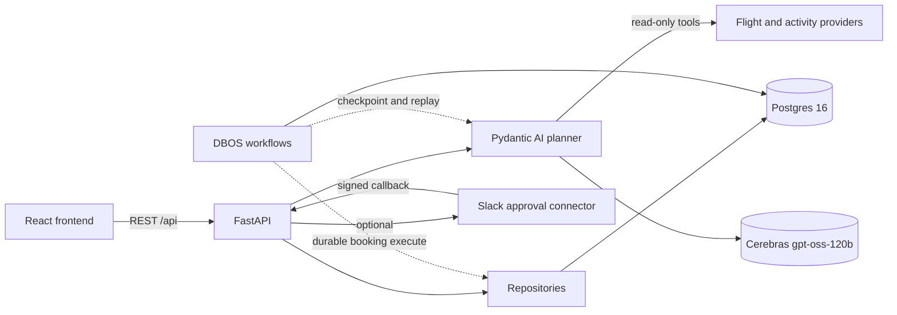
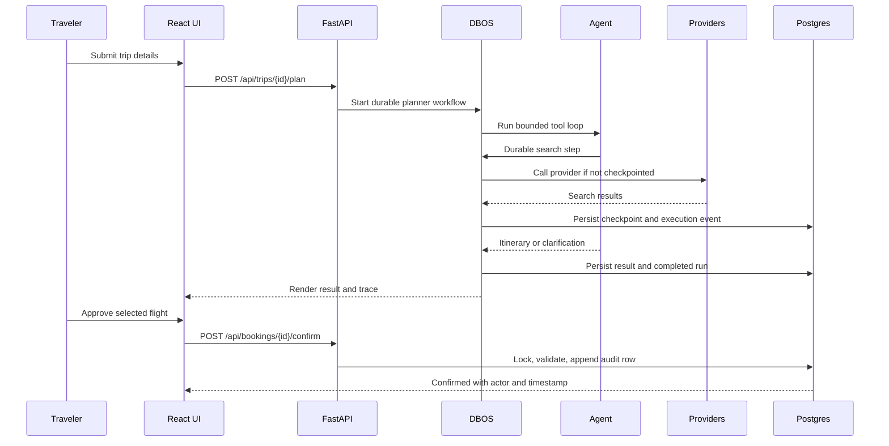

# TravelOps Agent

An AI travel-planning application that searches flight data, researches destination activities,
and generates an age- and fitness-aware itinerary. Required trip fields are validated at intake,
while ambiguous values can produce a clarifying question instead of an itinerary. A
**human-in-the-loop** state machine keeps booking handoff outside the agent: the model can research
and propose flights, but it has no tool that can approve or execute booking state changes.

> A small reference system for durable AI workflows: the planner is observable and replay-safe,
> booking requires an explicit human decision, and every decision is persisted as an audit trail.

## Zero-trust enterprise network extension

TravelOps also provides a runnable zero-trust architecture demonstration. Protected API routes
require a short-lived, server-backed session bound to identity, tenant, role, device, and MFA when
zero-trust enforcement is enabled. Tenant ownership and reusable policy checks protect resources;
internal agent calls use a separate service token; security events and incidents are append-only.
Repeated denials revoke the affected session.

Set `ZERO_TRUST_ENFORCED=true` to require a bearer token on protected API routes. The local issuer is
OIDC-shaped for the classroom demo, but intentionally small: it uses an application signing key and
TOTP rather than pretending to be a production IdP. Production deployment should put Keycloak or
another OIDC provider in front of the API and use mTLS/service-mesh identity for internal traffic.

The SPA signs in through `POST /api/auth/login`, submits the returned session to
`POST /api/auth/mfa`, stores the resulting 15-minute bearer token in browser storage, and attaches it
to every protected request. Set `ZERO_TRUST_SIGNING_SECRET` and use the seeded demo credentials or a
local user; MFA-enabled users must complete the TOTP step. Connector settings are deployment-wide,
not tenant-owned, and both reading and changing them require the `security-operator` or `admin` role
plus verified MFA.

## Start here

- [Architecture](#architecture) — the system boundary and critical request path.
- [Evaluation results](#evaluation-results) — 84/84 deterministic assertions passed in a 12-run
  sample; the optional quality judge passed 11/12.
- [Zero-trust demo](#zero-trust-demo) — deterministic identities, MFA, attacks, containment, and
  security-operations queries.
- [Engineering decisions](docs/DECISIONS.md) — deeper rationale and trade-offs.
- [Security evaluation](docs/SECURITY_EVALUATION.md) — actual focused-test results and pending
  PostgreSQL scenarios.

There is no public hosted demo yet. Run the local stack below, or use the walkthrough as a short
recorded demo script. The project intentionally does not present itself as a production travel
service: it does not purchase flights and has not been load-tested or security-audited.

## Zero-trust demo

```bash
docker compose up -d postgres
cp .env.example .env
# Set ZERO_TRUST_ENFORCED=true, ZERO_TRUST_SIGNING_SECRET, and AGENT_SERVICE_TOKEN in .env.
cd backend
uv run alembic upgrade head
uv run python scripts/seed_security_demo.py
uv run python scripts/security_demo.py
```

The synthetic accounts all use `demo-password` and the TOTP secret
`JBSWY3DPEHPK3PXP` (the script calculates the current six-digit code). The demo shows a valid
tenant-scoped request, MFA-gated operator access, token/session rejection, cross-tenant denial,
browser segment spoof rejection, five denials triggering session revocation, and the
security-operations event/incident query. These are classroom credentials; never reuse them.

## Three-minute walkthrough

This is the shortest useful demo for a reviewer. It shows agent research, persisted execution,
human approval, and audit history in one path.

1. Enter `JFK` → `San Diego`, `2026-09-01` → `2026-09-08`, age `78`, fitness `low`. Create the
   trip and click **Plan itinerary**.
2. Open **Agent execution** while it runs. Show the two read-only tools (`search_flights` and
   `web_search`), live events, persisted run status, tool results, token usage, and structured
   output. The low-fitness case cannot contain a `high`-intensity activity.
3. Select a flight and click **Review booking**. Pause at **Approve this flight**: the agent can
   propose, but it has no tool that can mutate booking state. Click approval, then **Continue to
   airline**. The app retrieves checkout links; it does not purchase or hold a fare.
4. Open **Approval history**. Show the transition, actor email, reason, and timestamp read from
   the append-only database trail.
5. For recovery, stop the backend during planning and restart it. DBOS resumes from Postgres
   checkpoints; completed Cerebras, flight, and activity steps are reused rather than re-issued.

For a repeatable demo, use the recorded flight and activity providers where possible. The LLM
call remains live.

## Architecture



The critical boundary is deliberate: the LLM researches and proposes; deterministic application
code owns booking state, durability, and accountability.



### Why DBOS durability matters

The planner and booking execution are `@DBOS.workflow`s backed by the same Postgres instance.
The planner's Cerebras completion, flight search, and activity search are individual durable
steps. If the process crashes, DBOS replays the workflow from its checkpoints and reuses completed
step results instead of charging the external provider again. This is crash recovery, not a claim
of exactly-once behavior across every provider.

## Approval and audit trail

Booking is a REST finite-state machine, not an agent tool:

`PENDING_USER_CONFIRMATION → CONFIRMED → EXECUTED`

Cancellation and fare expiry are terminal paths. Every legal transition is validated under a
`SELECT ... FOR UPDATE` lock and writes a `booking_transition` row in the same transaction. The
audit table is append-only at the database level: a Postgres trigger rejects updates and deletes.
The UI's **Approval history** tab shows the booking, route, state transition, human actor, reason,
and timestamp. Automatic expiry is distinguishable from a human decision because it has no actor.
Slack is an optional signed approval channel; it can confirm or reject, but cannot bypass the
state machine or purchase a ticket.

## Evaluation results

The eval suite uses four cases crossing age (`24`, `78`) and fitness (`low`, `high`) on the same
route, with recorded provider data and a live planner model. It checks output type, source URL
grounding, tool-call trajectory, flight exclusion, low-fitness safety, and physical-load
comparisons.

| Run | Result |
|---|---|
| Deterministic evals | 84/84 assertions passed across 12 case-runs (100%) |
| Optional `FitnessAppropriateness` judge | 11/12 passed |
| Judge finding | One high-fitness/older case was too conservative despite passing numeric load checks |

The judge result is intentionally reported rather than hidden: deterministic checks establish
hard invariants, while pacing and suitability still need subjective review.

## Failure and recovery examples

- **Stale fare:** after the 30-minute freshness window, approval or execution returns `EXPIRED`,
  records a system transition, and the UI asks the traveler to search again.
- **Planner over budget:** tool, token, and request limits bound the run; a `UsageLimitExceeded`
  result becomes `PlanTooComplexOut` instead of an unbounded loop.
- **Provider failure:** flight and activity providers are behind strategies, so recorded fixtures
  support repeatable tests and live providers can fail without leaking provider-specific code into
  the planner.
- **Process crash:** DBOS resumes checkpointed planner or booking work from Postgres. Persisted
  execution events and run rows remain available after restart.

The detailed implementation notes remain in [ARCHITECTURE.md](docs/ARCHITECTURE.md),
[EVALS.md](docs/EVALS.md), and [DECISIONS.md](docs/DECISIONS.md).

## Project status and limitations

This is a portfolio and reference implementation intended for local development and evaluation.
It is not a production travel service and has not been load tested or security audited. There is
no authentication: every request currently uses the same demo account, so the application must
not be exposed as an unrestricted public service. Activity citations show that a URL came from the
configured search provider; they do not independently verify every generated claim. The booking
flow returns third-party checkout links and does not reserve, purchase, or hold a fare.

See [Operational boundaries](docs/EVALS.md#operational-boundaries) for the detailed runtime,
security, recovery, and integration limitations.

## What it does

1. **Plan a trip** — origin, destination, dates, age, and fitness level are all required at
   intake. It can still ask a clarifying question if a provided value is ambiguous.
2. **Search flights** — SearchApi.io Google Flights results in live-provider mode, with
   route-and-date caching; recorded fixtures are available for repeatable tests and evals.
3. **Generate an attributed itinerary** — the agent researches activities through Tavily and
   returns a day-by-day plan. Each activity must cite a URL returned by that run's web search.
4. **Human-approved booking handoff** — review a proposed flight, explicitly approve it, then
   retrieve real checkout links, as three separate steps. Nothing here books a flight. Approval
   unlocks a deterministic, audited workflow whose output is airline/OTA checkout links with the
   chosen flight already attached; you complete the purchase on the carrier's own site, and the
   reference this app stores is its own audit id, not an airline confirmation number. Because no
   fare is actually held, a 30-minute freshness window guards against handing you a stale price:
   approving or executing past it marks the booking `EXPIRED` and asks you to search again.
5. **Watch the agent work** — an execution panel shows every run's tool calls, token usage,
   context-budget utilization, and timing. It's global across all of your trips (filterable
   by route and status), not just the one you're currently planning. A separate "Approval history"
   tab shows the other half of the audit trail: every human decision on a booking — who approved
   what and when — read straight from the append-only `booking_transition` table.
6. **Revisit any past trip** — a "Your trips" tab lists everything you've created, newest first
   and filterable by date range. Trips remain in Postgres until their rows are removed.

## Stack

- **Backend:** FastAPI, Pydantic AI, SQLModel/asyncpg, PostgreSQL 16, Alembic, DBOS (durable
  workflow execution, reuses the same Postgres instance).
- **LLM:** Cerebras `gpt-oss-120b` via Pydantic AI.
- **Flights:** SearchApi.io Google Flights structured responses, or recorded fixtures.
- **Activities:** Tavily web search.
- **Frontend:** React 19 + Vite + Tailwind CSS v4, TypeScript. A structured trip form drives the
  agent; a live activity feed streams its tool calls inline on the trip page, and a separate
  execution panel shows the full run trace across every trip. A "Your trips" tab lists every trip
  persisted for the demo account.
- **Evals:** `pydantic-evals` — deterministic scoring by default, with optional LLM-judged
  fitness-appropriateness scoring, separate from the pytest suite that gates system correctness.

Live-provider operation requires accounts and API credentials for the configured services.
Availability, pricing, and quotas are controlled by those providers and can change. For why each
provider was selected, see [DECISIONS.md](docs/DECISIONS.md).

## Running it

### 1. Database

Either Docker or a local Postgres install works.

```bash
# Docker
docker compose up -d
```

or, if you'd rather run Postgres natively (e.g. via Homebrew on macOS), just make sure a
`travel_agent` database exists and matches the `DATABASE_URL` you set in `.env` below.

### 2. Environment

```bash
cp .env.example .env
```

Fill in `CEREBRAS_API_KEY`, `SEARCHAPI_API_KEY`, and `TAVILY_API_KEY` (links to get each one are
in the file's comments). Adjust `DATABASE_URL` if you're not using the Docker default.

### 3. Backend

```bash
cd backend
uv sync
uv run alembic upgrade head
uv run uvicorn app.main:app --reload
```

Backend serves on `http://localhost:8000`; interactive docs at `/docs`.

### 4. Frontend

```bash
cd frontend
npm install
npm run dev
```

Frontend serves on `http://localhost:5173` (already whitelisted by the backend's CORS config).

### 5. Tests

```bash
cd backend
uv run pytest -q
uv run pyrefly check
# Focused zero-trust tests (the integration test needs PostgreSQL)
uv run pytest -q tests/test_zero_trust.py tests/test_zero_trust_integration.py
```

### 6. Evals

```bash
cd backend
uv run python -m evals.run --repeat 3
# Optional Gemini judge:
uv run python -m evals.run --with-judge
```

Scores the agent against a small dataset: do activity URLs come from the recorded search results,
does the run follow the expected tool-call trajectory, and do low-fitness cases avoid activities
labeled `high` intensity? These checks cover specific output properties; they do not establish
overall itinerary correctness or traveler safety. The default suite is deterministic;
`--with-judge` opts into the Gemini `FitnessAppropriateness` evaluator. The planner model call is
live in both modes, so running evals consumes Cerebras quota.

### 7. (Optional) Slack human-in-the-loop approvals

Booking approval can be routed through Slack instead of the in-app UI. Slack's Interactivity
callback needs a public HTTPS URL, so local development requires a tunnel:

```bash
ngrok http 8000
```

Use the printed `https://*.ngrok.io` URL as the Slack app's Request URL. Full setup steps
(app creation, tokens, channel config) are in [`docs/SLACK_SETUP.md`](docs/SLACK_SETUP.md).
Nothing here is required for the app to run — without it, the Connectors tab shows the Slack
toggle greyed out and booking approval stays in-app.

## Key decisions

The reasoning behind the REST state machine, typed outputs, provider failure handling, DBOS
workflows, append-only audit tables, request limits, and provider choices is documented in
[docs/DECISIONS.md](docs/DECISIONS.md).
