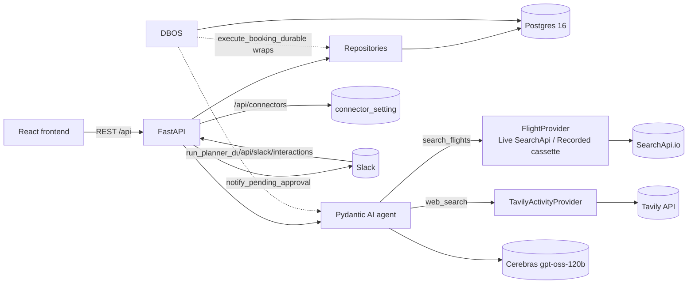
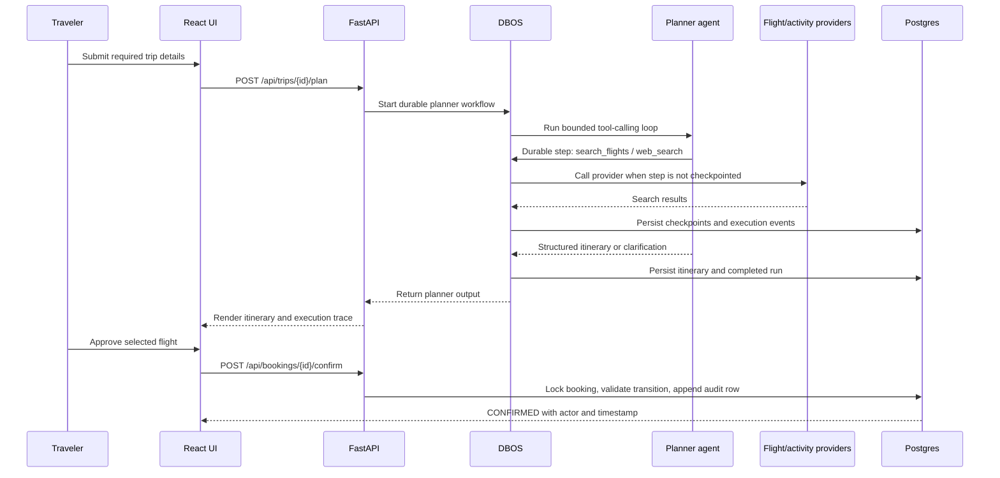

# Architecture

## System overview

## Zero-trust enterprise-network overlay

The application is a small enterprise-network simulation with six logical segments:
`web`, `api`, `agent`, `data`, `connector`, and `security-operations`. The zero-trust overlay
does not trust a request because it came from an internal segment. A request carries a signed
identity and device context, and the server evaluates tenant, role, device status, MFA status,
and the allowed segment path before a sensitive operation.

The security control plane implements the course's five required areas:

- **Identity and access management:** tenant, role, device, and disabled-identity attributes are
  persisted and checked server-side.
- **MFA:** security-operations actions require an MFA-verified access context. The local demo
  validates an issuer-supplied assertion; it does not implement a second-factor challenge.
- **Micro-segmentation:** service paths are an explicit allowlist rather than an implicit
  internal-network trust.
- **Continuous monitoring:** every security decision can be persisted as an append-only
  `security_event` with actor, device, segments, action, decision, reason, and correlation ID.
- **Incident response:** identity disablement and booking cancellation provide containment actions;
  security events preserve the evidence needed for an operator or external incident-management
  workflow.

This is an application-level and container-friendly demonstration, not a claim that FastAPI
replaces a production firewall, service mesh, enterprise IdP, or hardware MFA.

The backend is a single FastAPI process. The frontend is a separate static SPA that talks to it
over REST; there is no server-rendered coupling between them.

## The critical request path

The important boundary is visible in the sequence: the agent never receives a booking mutation
tool. Research is model-directed; booking state, durability, and auditability are application- and
database-owned.

**Why this stack:** FastAPI + Postgres/SQLModel + Pydantic AI (with a Cerebras-hosted open-weight
LLM) + React fit the application's relational data, transactional booking-state changes,
tool-calling loop, and separate browser interface. See "Why this stack, as a whole" in
[DECISIONS.md](DECISIONS.md) for the trade-offs.

## Capabilities → implementation

- **Cheapest flights:** `FlightSearchService` (`app/services/flight_search.py`) — the one
  implementation behind both `POST /api/trips/{trip_id}/flights/search` and the planner's
  `search_flights` tool —
  sorts every offer ascending by `price_usd` via `trips_repository.py::cheapest_first` (shared,
  not duplicated) on every path: fresh search, own-trip TTL reuse, cross-trip cache. A backend
  invariant rather than relying only on provider ordering; the UI renders offers in the returned
  order. The two callers differ only in `persist`/`allow_cross_trip_cache`: the route
  persists and reaches across trips, the planner tool trusts only this trip's own recent search
  and never writes offers (see "The agent has only two read-only tools" in `DECISIONS.md`).
  `POST /api/trips/{trip_id}/flights/search` is reachable on its own, independent of
  `POST /api/trips/{trip_id}/plan` — see "Flight search is its own user-facing capability" in
  `DECISIONS.md` for why.
- **Attributed itinerary, tailored to age/fitness:** `web_search` (Tavily) supplies activity
  research; `output_type=[ToolOutput(ItineraryOut),
  ToolOutput(ClarificationOut)]` (pinned to tool-call output rather than left on `auto`, since
  `gpt-oss-120b`'s native structured-output envelope was unreliable — see `docs/EVALS.md`) plus
  four output-validator guardrails in `app/agent/planner.py`: `reject_unsafe_intensity` ties
  activity intensity labels to the traveler's fitness level, `reject_ungrounded_itinerary` rejects
  any activity whose source URL was not returned by web search during that run,
  `reject_optional_clarification` blocks a clarifying question that re-asks for age/fitness once
  they're already present, and `reject_flight_activities` rejects flight-shaped items masquerading
  as itinerary activities.
- **Ask, don't assume:** genuinely ambiguous inputs (not missing ones — those are required at
  intake) produce a `ClarificationOut` instead of a guessed itinerary.
- **Visible UI:** React SPA with a live tool-call feed and an execution panel (see below).
- **HITL booking:** explicit confirm-then-execute clicks gate the booking handoff;
  see "HITL booking" below for what "execute" does and doesn't do.
- **Slack HITL connector:** an optional, DB-toggled Slack approval message with
  Confirm/Reject buttons offers the same gate through Slack instead of the UI; see "Slack HITL
  connector" below.

## Architectural patterns

Five patterns are used explicitly. This section maps each pattern to the code;
[DECISIONS.md](DECISIONS.md) records the trade-offs.

1. **Dependency Injection** (FastAPI `Depends`) — DB sessions (`get_session`) and external clients
   (flight provider, booking-options fetcher) are injected into route handlers, never constructed
   inside them. `agent/planner.py`'s `PlannerDeps` extends the same idea into the agent: the
   planner takes its `FlightProvider`/`ActivityProvider` as constructor args, so a test can hand it
   a fake without touching the model call.
2. **Finite State Machine** (`app/state.py`) — `ALLOWED_TRANSITIONS` is the single source of truth
   for booking state (`PENDING → CONFIRMED → EXECUTED`, +`CANCELLED`/`EXPIRED`); every transition
   is a guard clause (illegal move → 409) plus an append-only audit row in the same transaction.
   See "HITL booking" below and "HITL booking is a REST state machine, not an agent tool" in
   DECISIONS.md.
3. **Repository pattern** (`app/repositories/*`) — all Postgres access lives behind
   `trips_repository.py`/`booking_repository.py`; route handlers call the repository and shape a
   response, never build a query or own a transaction boundary themselves.
4. **Strategy pattern** (`FlightProvider` in `app/adapters/flights_searchapi.py`) — one `Protocol`,
   two interchangeable implementations (`LiveSearchApiProvider`, `RecordedProvider`) selected once
   at composition by `USE_LIVE_FLIGHT_API`. `FlightSearchService`, the route, and the planner tool
   all depend on the interface via DI and never branch on the toggle themselves.
5. **Durable execution, not Saga** (DBOS) — `execute_booking_durable` and the planner run are
   `@DBOS.workflow`s to checkpoint supported workflow steps for crash recovery. A
   single-DB booking write is already atomic (one ACID transaction + `SELECT ... FOR UPDATE`), so
   this is durable-execution for crash recovery, not classic Saga compensation — compensation
   (release a hold, refund a charge) would only apply to a real multi-step airline booking, which
   this application does not perform. `execute_booking` separates the external fetch from the
   state transition, leaving a clear extension point if the workflow grows.

`FlightSearchService`/`ExecutionService` (see "Flight search and execution-run lifecycle are
extracted services" in DECISIONS.md) are a sixth, smaller pattern in the same family — extracting
duplicated logic behind one interface — but weren't part of the original five; they're a
refactor-era addition once the duplication became real, not a pattern picked up front.

## APIs & AI protocols

**External APIs:**

| API | Role | Adapter |
|---|---|---|
| Cerebras (`gpt-oss-120b`) | The planner LLM — reasoning, tool selection, structured output. | Pydantic AI `CerebrasModel`/`CerebrasProvider` in `planner.py`. |
| SearchApi.io Google Flights | Flight offers and booking-option links in live mode. | `flights_searchapi.py` (Live vs Recorded strategy). |
| Tavily | Activity-search results with source URLs. | `activities_tavily.py`. |
| Slack (optional) | Approval message with Confirm/Reject buttons; signed callback. | `slack_hitl.py` + `routes/slack.py`. |

**AI protocols:**

- **REST** between the React frontend and FastAPI backend.
- **LLM tool/function calling** — the model chooses when to call `search_flights` and
  `web_search`; results feed back into its context.
- **JSON Schema structured output** — Pydantic AI validates the model's output against
  `output_type=[ItineraryOut, ClarificationOut]`; "ask, don't assume" is a type, not a hope.
- **ReAct-style agent loop** — `agent.iter(...)` drives a reason → act (tool call) → observe
  cycle until the model resolves to a final structured output.

**Supporting engineering (not protocols, but load-bearing):**

- **Usage limits** — `UsageLimits(tool_calls_limit=MAX_TOOL_STEPS,
  total_tokens_limit=MAX_CONTEXT_TOKENS, request_limit=MAX_REQUESTS_PER_RUN)` bounds each loop.
  `UsageLimitExceeded` is mapped to `PlanTooComplexOut` ("too complex for one pass"). Other
  provider and application failures are not covered by that fallback.
- **Rate limiting** — a per-IP request cap (`RATE_LIMIT_MAX_REQUESTS=10`/
  `RATE_LIMIT_WINDOW_SECONDS=60` in `app/rate_limit.py`) gates the planning and flight-search
  routes, `POST /api/trips/{trip_id}/plan` and `POST /api/trips/{trip_id}/flights/search`, separate
  from the `MAX_CONCURRENT_AGENT_RUNS` concurrency slot above: the concurrency slot caps
  simultaneous LLM calls, while this caps request *volume* as observed by one process. The limiter
  is in memory, resets on restart, and has not been verified behind a hosted reverse proxy.
- **Prompt-injection mitigation** — `sanitize_web_content` truncates and delimits Tavily text before
  it reaches the model. This reduces direct instruction mixing but is not a security boundary.
- **Durable steps (DBOS)** — the planner run and booking execute are checkpointed workflows that
  resume after a crash.
- **Observability** — `AgentRun`/`AgentRunStep` rows are derived from the real message history and
  usage, powering the execution panel.
- **Eval scoring (`pydantic-evals`)** — deterministic evaluators by default, plus an opt-in
  `LLMJudge` for fitness-appropriateness behind `--with-judge`. See [EVALS.md](EVALS.md) for the
  exact-vs-subjective split and why.

## Request/agent flow

**Planning a trip** (`POST /api/trips/{trip_id}/plan`): `plan_trip` is idempotent per trip
(`get_or_create_itinerary` returns an existing `Itinerary` row as-is). Otherwise it calls
`run_planner_durable` (`app/dbos_runtime.py`), which acquires a concurrency slot
(`acquire_agent_run_slot`, caps concurrent real LLM calls) and runs the `@DBOS.workflow`-wrapped
planner: `ExecutionService(session).start_run(...)` binds an `ExecutionRun` for the trip, then
`agent.iter(...)` drives a ReAct-style loop over `search_flights`/`web_search`, capped by
`MAX_TOOL_STEPS`/`MAX_CONTEXT_TOKENS`. The agent's own structured output is `ItineraryOut |
ClarificationOut` — a `ClarificationOut` returns questions without persisting an itinerary; an
`ItineraryOut` persists and moves the trip to `ITINERARY_READY`. One level up, `dbos_runtime.py`
catches `UsageLimitExceeded` around that call and turns it into a `PlanTooComplexOut` instead of
  letting the crash propagate, so what `run_planner_durable`/`POST /api/trips/{trip_id}/plan` actually
  return is the wider
`PlannerOutput` union (`ItineraryOut | ClarificationOut | PlanTooComplexOut`, `app/schemas.py`).
Every tool call records an `ExecutionEvent`
through the bound run, and `ExecutionRun.persist_result` (wrapping `persist_agent_run`) derives
`AgentRun`/`AgentRunStep` rows from captured message history and usage on both the success and
handled crash-recovery failure paths — `ExecutionService`/`ExecutionRun`
(`app/agent/execution_log.py`) is the one place that finalizes a run, so there's exactly one
finalization path to reason about, not two. The concurrency slot releases in a `finally`, outside
the DBOS-wrapped call — see [DECISIONS.md](DECISIONS.md) for why that placement matters.
`POST /api/trips/{trip_id}/flights/search` (outside the agent loop) still binds its own run through
the lower-level `execution_context()` directly, since it isn't wrapped in a DBOS workflow.

**Booking a flight** (the HITL gate): a REST state machine, not an agent capability. See
"HITL booking" below.

**Watching a run**: `GET /api/trips/{trip_id}/execution` reads every `AgentRun` with its owned
`AgentRunStep`s and `ExecutionEvent`s, shaped into `ExecutionPanelOut` with derived context usage
and estimated cost. The response also retains the trip-wide event stream for LiveActivity; the
execution panel renders events only inside their owning run. `GET /api/execution` is the same
shape across every trip the user owns (`GlobalExecutionPanelOut`) — it backs the "Agent execution
history" tab, which is global rather than scoped to whichever trip is currently active (see
"Trip history is a list endpoint plus a global execution feed" in `DECISIONS.md`). The tab filters
that list client-side by route text and run status; `GET /api/trips` (also newest-first,
user-scoped) backs the sibling "Your trips" tab, filtered client-side by a date-range dropdown.

## Data model

Five core tables (`user_account`, `trip_request`, `flight_search_result`, `itinerary`,
`hitl_booking_log`), one connector-config table (`connector_setting` — a single-row, DB-backed
toggle so the Slack connector can be flipped at runtime without a restart), and four
audit/observability tables (`booking_transition`, `execution_event`, `agent_run`, `agent_run_step`)
in `app/models.py`. `booking_transition` and `execution_event` are append-only, enforced by a
Postgres trigger (`reject_audit_row_mutation()`) — `UPDATE`/`DELETE` raises at the database level
regardless of what application code attempts. Deliberately relational, not a document store — see
"PostgreSQL over a NoSQL store" in [DECISIONS.md](DECISIONS.md).

## HITL booking (`app/state.py`)

`ALLOWED_TRANSITIONS` is the single source of truth; a move not listed is rejected with a 409.
`execute_booking` claims the row with `SELECT ... FOR UPDATE`, re-checks state under that lock, and
serializes concurrent execute requests. The database-backed concurrency test asserts that two
simultaneous execute attempts produce one `booking_options` fetch. This state machine lives outside the agent; the agent
can plan and search but has no tool that can move a booking's state, so "a human must click
confirm, then execute" is structural, not a prompt instruction the model could be talked out of.

**Scope note:** "execute" fetches real booking options from SearchApi and stamps an internal
`TA-*` reference on the `HITLBookingLog` row — it's a human-confirmed booking *handoff*, not a
real airline reservation/purchase (no PNR, no payment). Those options render as per-provider
checkout buttons the traveler clicks through to complete the purchase on the carrier's own site,
so no fare is held by this application; `BOOKING_TTL_MINUTES` is an internal price-freshness window, checked
lazily on confirm/execute rather than by any sweeper. Completing a real purchase is out of scope
for this project; see [DECISIONS.md](DECISIONS.md).

## Slack HITL connector (`app/adapters/slack_hitl.py`, `app/routes/slack.py`, `app/routes/connectors.py`)

Optional, off by default. `GET /api/connectors` reads and `PATCH /api/connectors/slack` flips the
single-row `connector_setting.slack_enabled` toggle, gated so it can only be enabled when
`SLACK_BOT_TOKEN`/`SLACK_SIGNING_SECRET`/`SLACK_APPROVALS_CHANNEL_ID` are all configured (409
otherwise). The frontend's Connectors tab (`ConnectorsPanel.tsx`) drives this toggle.

When enabled, `request_booking` (`routes/booking.py`) additionally posts a Confirm/Reject Block
Kit message via `notify_pending_approval`; Slack's callback hits `POST /api/slack/interactions`,
which verifies the request signature (stdlib `hmac`, constant-time compare) before resolving to
the same `confirm_booking`/`reject_booking` repository calls the in-app buttons use — Slack is an
alternate front door to the identical state machine, not a second one. Slack's Interactivity
config requires a public HTTPS URL for that callback, so local development tunnels the backend
with `ngrok http 8000`. See [SLACK_SETUP.md](SLACK_SETUP.md) for setup and
[DECISIONS.md](DECISIONS.md) for why this is a hand-rolled adapter instead of a third-party chat
SDK.

## Agent Execution Panel

Two separate trails, on purpose. `execution_event`/`agent_run` answer "what did the **agent** do?"
and back the Agent execution history tab; `booking_transition` answers "what did the **human**
decide?" and backs the Approval history tab (`GET /api/bookings` → `ApprovalHistoryPanel`, every
booking this user requested with its transition trail). A human clicking Confirm is not agent
execution, and keeping the decision in a trigger-enforced append-only table with actor
attribution is easier to query separately than if it were folded into the agent's tool log.

Watch the agent work, live or after the fact: each run card combines metrics, model calls, tool
calls, the structured output, and its own API/protocol activity. The output is its own
`AgentStepKind.OUTPUT` rather than a tool call — pydantic-ai delivers a result by calling a
synthetic `final_result_<Type>` tool, so grouping it with `search_flights`/`web_search` made the
itinerary look like an agent tool invocation. A refused attempt is recorded `rejected`, which is
what a retry-exhausted run looks like. Backed by persisted
`agent_run`/`agent_run_step`/`execution_event` rows rather than only in-memory state, the panel can
display captured runs from before the current process started. It is application tracing, not a
complete distributed-observability system.

## Durable execution (DBOS)

Two flows are wrapped as `@DBOS.workflow`s to support checkpointed crash recovery:
`execute_booking_durable` (`app/dbos_runtime.py`) and the planner run
(`_run_planner_workflow`). DBOS reuses the app's own Postgres instance (its own `dbos` schema) —
no additional infrastructure. Because DBOS workflows must take only serializable arguments and
may replay their body during crash recovery, both durable entry points rebuild their
session/provider dependencies internally rather than receiving them injected, and neither
mutates plain in-process state (locks, counters) from inside the workflow body — see
[DECISIONS.md](DECISIONS.md) for the concurrency-limiter bug this constraint caused and how it
was fixed.

Within the planner run, the three calls that spend real external quota are each wrapped in their
own `@DBOS.step` — the Cerebras completion (`agent.model.request`), the flight search
(`FlightProvider.search_offers`), and the activity search (`ActivityProvider.search`) — so a
crash-recovery replay reuses each call's recorded result instead of re-issuing it. See
[DECISIONS.md](DECISIONS.md) for why these are wrapped as free functions rather than decorating
the bound methods directly.
